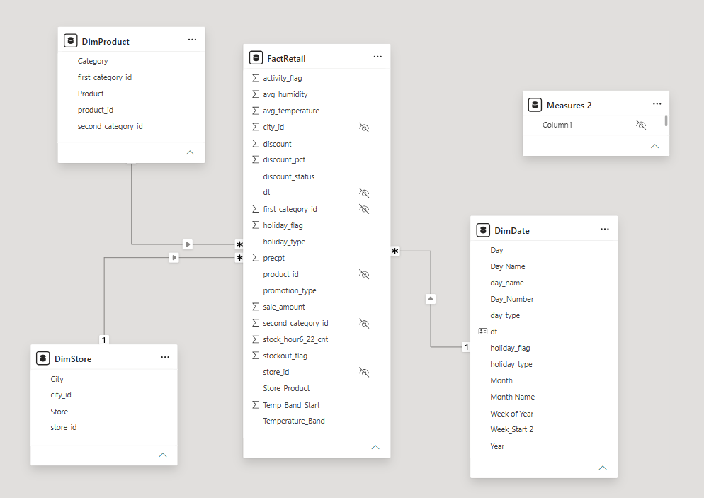
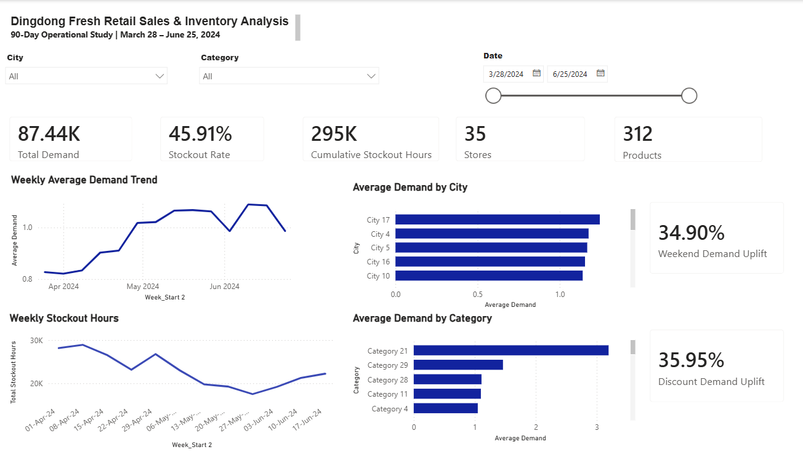
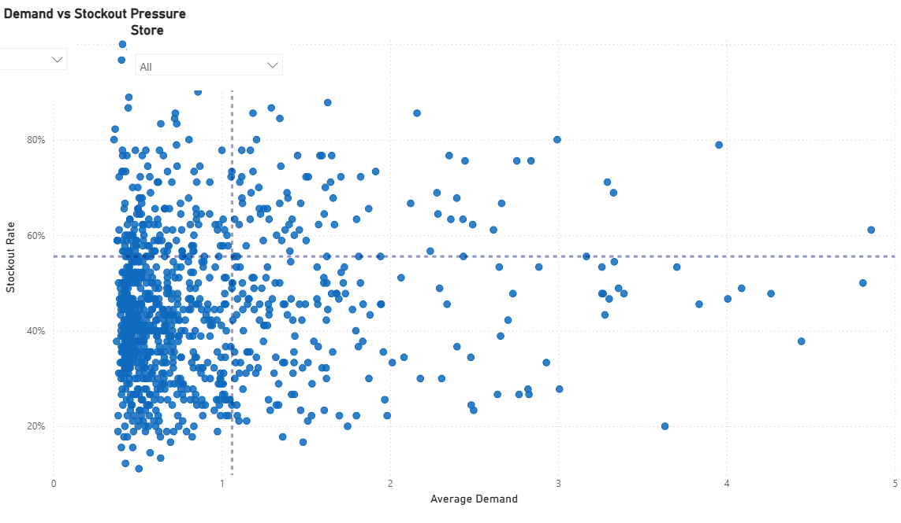
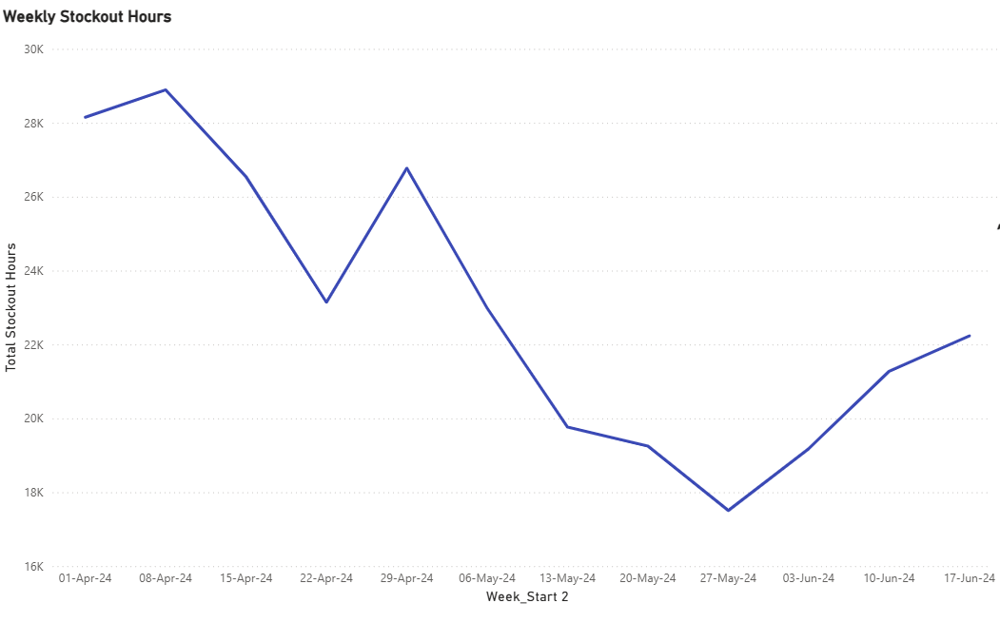
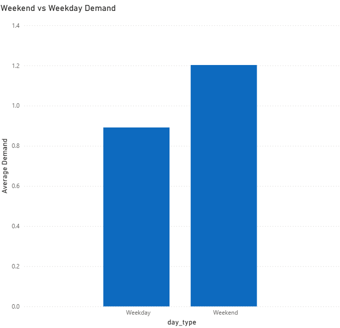
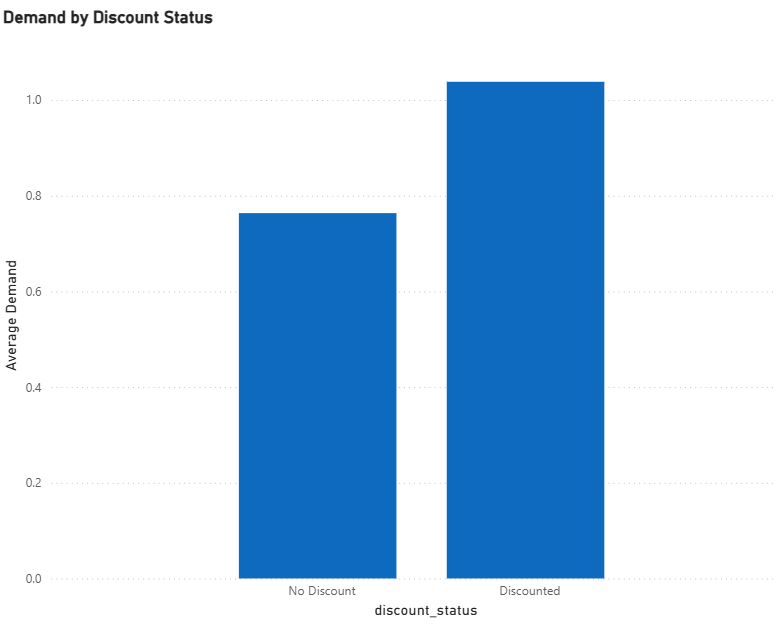
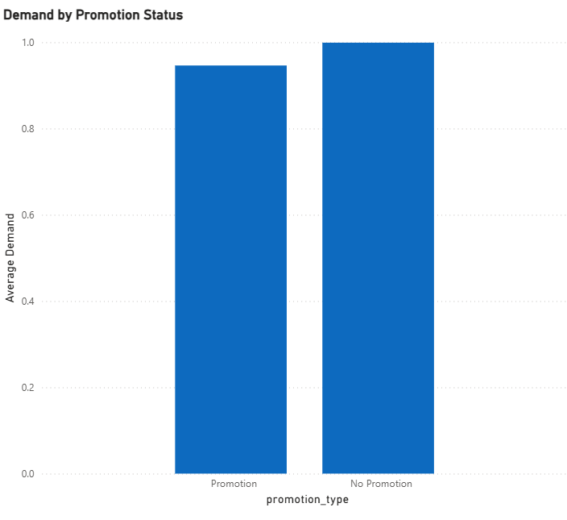
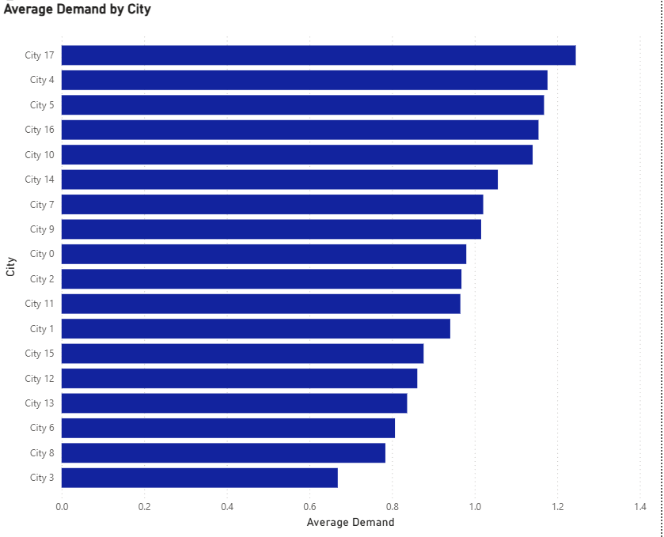

# Dingdong Fresh Retail Inventory Analysis

A retail demand and inventory analysis using **Excel, Power Query, MySQL, and Power BI** to identify stockout risks, demand patterns, and opportunities to improve product availability.

---

## Background and Overview

Dingdong Fresh (also known as Dingdong Maicai) is a major on-demand e-commerce and fresh grocery platform in China. Founded in 2017 and headquartered in Shanghai. They operate in a retail sector, where maintaining product availability is especially important because demand can change quickly across locations, products, promotional periods, weekends, holidays, and weather conditions. For a fresh-retail business, frequent stockouts can lead to unmet customer demand, while poor inventory planning can also create operational inefficiencies for perishable products.

I analyzed a **90-day sample derived from Dingdong's FreshRetailNet-50K dataset** to understand how product demand and stockout activity vary across stores, products, cities, promotional conditions, and external factors.

The primary goal of this project was to identify where inventory availability problems are most concentrated and uncover demand patterns that could support more targeted inventory planning and replenishment decisions.

The analysis was completed using **Excel and Power Query** for data preparation and exploratory analysis, **MySQL** for SQL-based analysis, and **Power BI** for data modeling, DAX calculations, and dashboard development.

### Key Areas of Analysis

- **Inventory Availability:** Evaluation of stockout frequency and cumulative stockout hours to determine the extent of product availability challenges and identify Store × Product combinations experiencing the greatest inventory pressure.
- **Demand Performance:** Analysis of average and total product demand across stores, cities, and product categories to identify areas with comparatively stronger or weaker demand.
- **Product Prioritization:** Assessment of Store × Product combinations based on both demand and stockout rate to identify products that require greater inventory attention.
- **Promotions and Discounts:** Comparison of demand during promotional, non-promotional, discounted, and non-discounted periods to determine whether these commercial activities are associated with changes in demand.
- **Calendar-Based Demand Patterns:** Evaluation of demand across weekdays, weekends, and holidays to identify predictable periods of stronger demand and increased stockout pressure.
- **External Demand Factors:** Analysis of temperature patterns to determine whether changes in weather conditions are associated with changes in product demand.

Overall, this project aims to transform operational retail data into actionable insights that can help Dingdong **prioritize high-risk inventory, improve product availability, and make more informed inventory-planning decisions**.

### Project Files

- **The interactive Power BI dashboard for this project can be downloaded** [here](powerbi/Dingdong_Retail_Analysis.pbix)
- **The SQL queries used for data quality checks and dataset validation can be found** [here](sql/Dingdong_Data_Quality_Checks.sql)
- **Target SQL queries used to create the analytical views regarding various business questions can be found** [here](sql/Dingdong_Retail_Analysis.sql)
- **The Excel workbook used for data cleaning, validation, and exploratory analysis can be downloaded** [here](excel/Dingdong_Retail_Analysis.xlsx)
- **The Key Findings Excel workbook summarizing the main insights from the analysis can be downloaded** [here](excel/Dingdong_Key_Findings.xlsx)

---

## Data Structure Overview

The analysis dataset contains **89,100 daily Store × Product observations** covering a **90-day period from March 28 to June 25, 2024**.

After cleaning and preparation, the data was modeled in Power BI using a **star schema** consisting of one fact table and three dimension tables.

| Table | Description | Rows |
|---|---|---:|
| `FactRetail` | Daily Store × Product demand, stockout, discount, promotion, and weather observations | 89,100 |
| `DimStore` | Store and city information | 35 |
| `DimProduct` | Product and category information | 312 |
| `DimDate` | Calendar and date attributes | 90 |

`FactRetail` is the central table and connects to the Store, Product, and Date dimensions through one-to-many relationships.

### Power BI Data Model

> Add your Power BI Model View screenshot to `images/data_model.png`.

### Main Analytical Fields

- **Demand:** `sale_amount`
- **Inventory availability:** `stock_hour6_22_cnt`, `stockout_flag`
- **Product hierarchy:** `product_id`, `first_category_id`, `second_category_id`
- **Location:** `store_id`, `city_id`
- **Pricing activity:** `discount`, `discount_status`
- **Promotions:** `activity_flag`, `promotion_type`
- **Calendar:** date, day of week, weekday/weekend, holiday status, and week start
- **Weather:** temperature, precipitation, and humidity

Prior to beginning the analysis, a series of quality-control and familiarization checks were performed using SQL. These checks included validation of row counts, missing values, duplicate records, Store × Product time-series completeness, numeric ranges, categorical flags, product-category mappings, and unusual discount records.

The SQL queries used for these data-quality checks can be found [here](sql/Dingdong_Data_Quality_Checks.sql).

---

## Executive Summary

The analysis shows that Dingdong's main operational challenge is **product availability during periods of strong demand**.

Across **89,100 Store × Product observations**, the overall **stockout rate was 45.91%**, indicating that stockouts were a frequent issue during the 90-day analysis period.

The problem was also concentrated rather than spread evenly across all products. **87 Store × Product combinations** were identified as both high demand and high stockout, making them the highest-priority areas for inventory attention.

Demand also followed clear patterns. **Weekend demand was 34.90% higher than weekday demand**, while discounted observations were associated with **35.95% higher average demand** than non-discounted observations.

Demand levels also varied across cities, products, and time periods, suggesting that a single inventory strategy would not be equally effective across all locations and products.

Overall, the analysis indicates that Dingdong can improve product availability by focusing inventory planning on **high-risk Store × Product combinations, predictable weekend demand, discount-related demand increases, and geographic differences in demand**.

### Dashboard Overview

The full interactive Power BI dashboard can be downloaded [here](powerbi/Dingdong_Retail_Analysis.pbix).

---

## Insights Deep Dive

### 1. Inventory Availability

The overall **stockout rate was 45.91%**, meaning that nearly half of all daily Store × Product observations experienced at least one stockout hour during the 90-day period.

The analysis identified **87 high-demand/high-stockout Store × Product combinations**. This shows that the most serious availability problems were concentrated among a smaller group of products and locations rather than affecting the entire assortment equally.

The scatter plot highlights Store × Product combinations based on both average demand and stockout rate. Combinations falling above both the demand and stockout thresholds represent the highest-priority inventory concerns.

Weekly stockout hours generally declined through April and May even as demand remained strong. By June, however, stockout hours began increasing again, indicating renewed inventory pressure toward the end of the analysis period.

---

### 2. Demand Trends

Average demand was approximately **34.90% higher on weekends than on weekdays**, increasing from about **0.89 on weekdays to 1.20 on weekends**.

This increase was also accompanied by greater inventory pressure. Average stockout hours increased from approximately **3.21 hours on weekdays to 3.56 hours on weekends**.

The pattern suggests that weekends represent a predictable period of both **stronger demand and greater product-availability risk**.

---

### 3. Discounts and Promotions

Discounted observations recorded average demand of approximately **1.04**, compared with **0.76 for non-discounted observations**. This represents a **35.95% higher average demand** for discounted observations.

This indicates that discounted periods were associated with stronger demand and may therefore require additional inventory planning to reduce the risk of stockouts.

Promotional activity showed a different pattern. Average demand during promotional observations was approximately **0.95**, compared with **1.00 during non-promotional observations**.

At the overall level, promotions were therefore **not associated with higher average demand**. This suggests that promotional effectiveness may vary depending on the product, category, store, or location.

---

### 4. Geographic Demand Differences

Demand varied substantially across cities.

**City 17 recorded average demand of approximately 1.24**, while **City 3 averaged approximately 0.67**.

This difference shows that demand is not evenly distributed geographically and suggests that inventory requirements may need to vary by location rather than following a single approach across all cities.

---

## Recommendations

Based on the insights uncovered in the analysis, the following actions should be prioritized:

- **Prioritize high-risk products:** Focus inventory monitoring on the **87 Store × Product combinations** identified as both high demand and high stockout.
- **Prepare for weekend demand:** Weekend demand was **34.90% higher**, so stock levels should be reviewed and strengthened before weekends.
- **Coordinate discounts with inventory:** Discounted periods were associated with **35.95% higher demand**, so discount activity should be supported by sufficient stock availability.
- **Use location-specific stocking:** Demand varied significantly by city, so inventory allocation should reflect local demand patterns rather than using one approach everywhere.
- **Review promotional effectiveness:** Promotions did not show higher overall demand, so they should be evaluated by product, category, and location before being expanded.
- **Improve future data collection:** Incorporating inventory on hand, reorder quantities, supplier lead times, product prices, costs, and lost sales would support more precise replenishment planning and financial-impact analysis.

---

## Caveats

- **Limited analysis period:** The dataset covers only 90 days, so long-term seasonality and annual demand trends cannot be fully assessed.
- **No financial data:** `sale_amount` represents normalized demand rather than revenue, so the financial impact of stockouts cannot be calculated.
- **Limited inventory detail:** Inventory-on-hand, reorder levels, supplier lead times, and replenishment quantities are unavailable, preventing exact reorder recommendations.
- **Associations, not causation:** Relationships involving weekends, discounts, promotions, holidays, and temperature should be interpreted as observed patterns rather than proven causes of demand changes.

